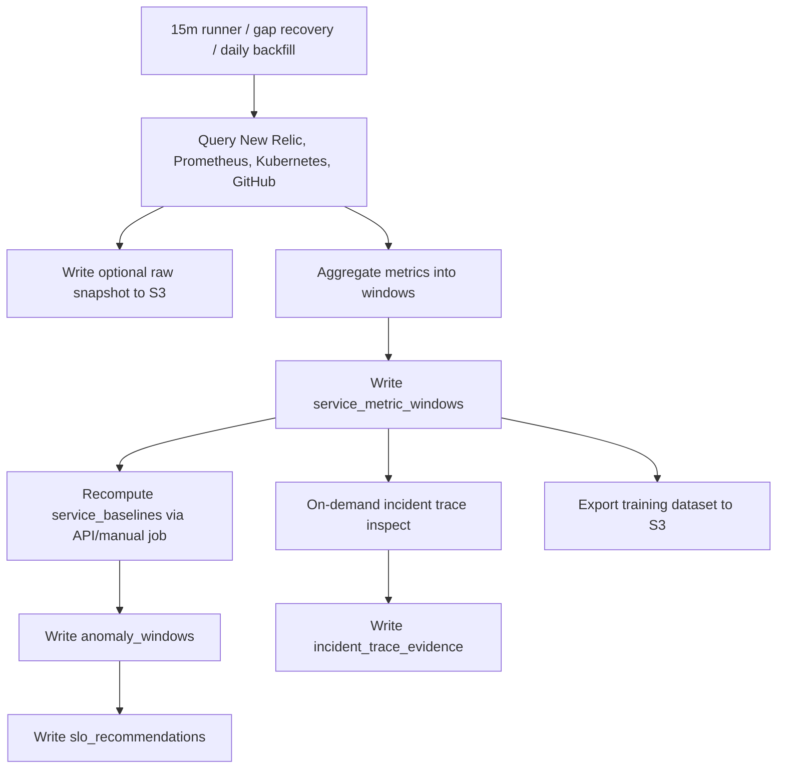

# 数据存储方案

## 一、推荐结论

第一版建议使用：

| 存储 | 用途 | 推荐 |
| --- | --- | --- |
| PostgreSQL | 服务目录、聚合窗口、动态基线、异常标签、SLO 建议、incident timeline | AWS RDS PostgreSQL 或已有 Postgres |
| S3/Object Storage | 原始查询快照、长报告、训练数据导出、离线分析文件 | S3 bucket |
| pgvector | runbook、postmortem、incident 总结的向量检索 | PostgreSQL 扩展，后续启用 |

不要把 New Relic/Prometheus 的原始 metrics 全量复制到数据库。只保存切窗后的聚合特征、标签、证据和必要的原始快照引用。

## 二、为什么这样分层

| 数据类型 | 特点 | 存储位置 |
| --- | --- | --- |
| 15m/1h 聚合窗口 | 需要频繁查询、训练、筛选 | PostgreSQL |
| 异常标签 | 需要可追溯、可版本化、可人工修正 | PostgreSQL |
| SLO 建议 | 需要审核状态和历史版本 | PostgreSQL |
| incident timeline | 结构化事件，查询频繁 | PostgreSQL |
| incident trace evidence | 按需 New Relic trace 摘要和 RCA 证据 | PostgreSQL |
| New Relic/Prometheus 查询原始响应 | 体积较大，不常查 | S3 |
| Agent 生成的长报告 | 文本较长，审计用 | S3 + PostgreSQL metadata |
| 离线训练集导出 | 批量文件，供 notebook/训练任务使用 | S3 |

## 三、核心表设计

### `services`

服务目录的数据库版本，可由 `config/service-catalog.yaml` 同步。

```sql
create table services (
  service_id text primary key,
  description text,
  owner text,
  github_repo text not null,
  production_branch text not null default 'master',
  newrelic_app_name text,
  newrelic_app_id text,
  newrelic_entity_guid text,
  k8s_cluster text,
  k8s_namespace text,
  k8s_workload_kind text,
  k8s_workload_name text,
  k8s_label_selector text,
  tags text[] not null default '{}',
  created_at timestamptz not null default now(),
  updated_at timestamptz not null default now()
);
```

### `service_metric_windows`

长期训练和回放的核心表。

```sql
create table service_metric_windows (
  id bigserial primary key,
  service_id text not null references services(service_id),
  window_start timestamptz not null,
  window_end timestamptz not null,
  window_size text not null,
  newrelic jsonb not null default '{}',
  prometheus_resources jsonb not null default '{}',
  kubernetes jsonb not null default '{}',
  change_context jsonb not null default '{}',
  data_quality jsonb not null default '{}',
  source_snapshot_uri text,
  created_at timestamptz not null default now(),
  unique (service_id, window_start, window_size)
);
```

建议索引：

```sql
create index service_metric_windows_service_time_idx
  on service_metric_windows (service_id, window_start desc);

create index service_metric_windows_window_size_idx
  on service_metric_windows (window_size, window_start desc);

create index service_metric_windows_newrelic_gin_idx
  on service_metric_windows using gin (newrelic);
```

### `service_baselines`

保存动态基线，避免每次都从窗口表全量计算。

```sql
create table service_baselines (
  id bigserial primary key,
  service_id text not null references services(service_id),
  baseline_version text not null,
  metric_name text not null,
  day_of_week int,
  hour_of_day int,
  traffic_bucket text,
  p50 double precision,
  p75 double precision,
  p90 double precision,
  p95 double precision,
  p99 double precision,
  sample_count int not null,
  valid_from timestamptz not null,
  valid_to timestamptz,
  created_at timestamptz not null default now()
);
```

### `anomaly_windows`

保存异常标签。标签是可版本化资产，不要覆盖旧版本。

```sql
create table anomaly_windows (
  id bigserial primary key,
  service_id text not null references services(service_id),
  window_start timestamptz not null,
  window_end timestamptz not null,
  window_size text not null,
  is_anomaly boolean not null,
  severity text not null,
  anomaly_types text[] not null default '{}',
  confidence text not null,
  label_source text[] not null default '{}',
  label_rule_version text not null,
  baseline_version text,
  evidence jsonb not null default '[]',
  reviewed boolean not null default false,
  reviewer text,
  review_note text,
  created_at timestamptz not null default now()
);
```

### `incident_windows`

保存人工确认的 incident 影响窗口，作为最高质量标签。

```sql
create table incident_windows (
  id bigserial primary key,
  incident_id text not null,
  service_id text not null references services(service_id),
  impact_start timestamptz not null,
  impact_end timestamptz,
  severity text,
  root_cause_category text,
  summary text,
  source_url text,
  created_at timestamptz not null default now()
);
```

### `incident_trace_evidence`

保存 incident inspect 时按需查询的 New Relic trace 摘要。Trace 不进入常规
15m runner，只在 incident inspect 或高风险深查时查询。

```sql
create table incident_trace_evidence (
  id bigserial primary key,
  service_id text not null references services(service_id),
  window_start timestamptz not null,
  window_end timestamptz not null,
  newrelic_account_id text,
  newrelic_app_name text,
  status text not null,
  trace_summary jsonb not null default '{}',
  errors jsonb not null default '[]',
  created_at timestamptz not null default now()
);
```

### `slo_recommendations`

保存 SLO 建议和审核状态。

```sql
create table slo_recommendations (
  id bigserial primary key,
  service_id text not null references services(service_id),
  recommendation_version text not null,
  recommendation_window text not null,
  historical_baseline jsonb not null,
  recommended_slo jsonb not null,
  confidence text not null,
  evidence jsonb not null default '[]',
  status text not null default 'pending_review',
  reviewer text,
  review_note text,
  created_at timestamptz not null default now(),
  reviewed_at timestamptz
);
```

### `artifact_refs`

保存 S3 对象引用。

```sql
create table artifact_refs (
  id bigserial primary key,
  artifact_type text not null,
  service_id text references services(service_id),
  related_id text,
  uri text not null,
  content_type text,
  metadata jsonb not null default '{}',
  created_at timestamptz not null default now()
);
```

## 四、S3 路径设计

```text
s3://sre-agent-data/
  raw-snapshots/
    newrelic/service=<service>/date=YYYY-MM-DD/window=<window>.json
    prometheus/service=<service>/date=YYYY-MM-DD/window=<window>.json
    kubernetes/service=<service>/date=YYYY-MM-DD/window=<window>.json
  reports/
    incidents/incident_id=<id>/report.md
    risk/service=<service>/date=YYYY-MM-DD/report.json
  exports/
    training/date=YYYY-MM-DD/window_size=15m/data.parquet
```

## 五、数据流



## 六、保留策略

| 数据 | 保存 |
| --- | --- |
| `service_metric_windows` 5m/15m/1h | 12-24 个月 |
| `service_baselines` | 12-24 个月，按 version 保留 |
| `anomaly_windows` | 24 个月或永久 |
| `incident_windows` | 永久 |
| `slo_recommendations` | 永久 |
| S3 raw snapshots | 30-90 天，按成本控制 |
| S3 reports / training exports | 12-24 个月 |

## 七、MVP 可以更简单

如果想先快速启动，MVP 只需要：

| 必需表 | 原因 |
| --- | --- |
| `services` | 从 service catalog 查服务上下文 |
| `service_metric_windows` | 保存 30 天之外的训练窗口 |
| `anomaly_windows` | 保存异常标签 |
| `slo_recommendations` | 保存 SLO 建议 |

S3 可以先只存 Agent 报告和原始查询快照。等数据量上来，再做 Parquet 导出和离线训练。
