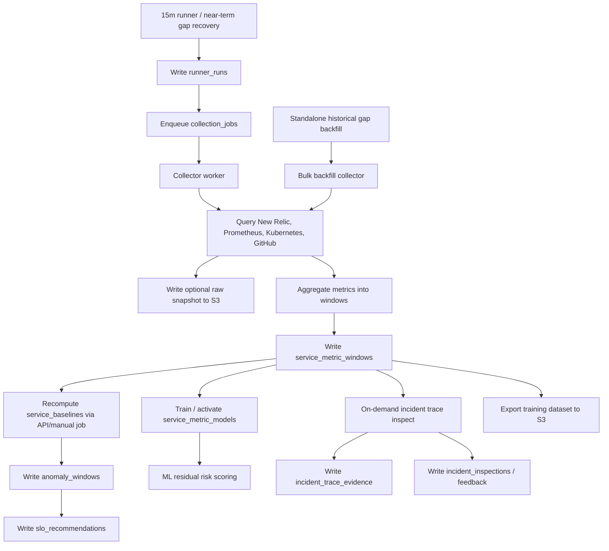

# 数据存储方案

## 一、推荐结论

第一版建议使用：

| 存储 | 用途 | 推荐 |
| --- | --- | --- |
| PostgreSQL | 服务目录、聚合窗口、动态基线、异常标签、SLO 建议、incident timeline | AWS RDS PostgreSQL 或已有 Postgres |
| S3/Object Storage | 原始查询快照、长报告、训练数据导出、离线分析文件 | S3 bucket |
| pgvector | runbook、postmortem、incident 总结的向量检索 | PostgreSQL 扩展，后续启用 |

不要把 New Relic/Prometheus 的原始 metrics 全量复制到数据库。只保存切窗后的聚合特征、标签、证据和必要的原始快照引用。

## 二、为什么这样分层

| 数据类型 | 特点 | 存储位置 |
| --- | --- | --- |
| 15m/1h 聚合窗口 | 需要频繁查询、训练、筛选 | PostgreSQL |
| collector run/job audit | 需要追踪每轮采集、失败、重试、耗时 | PostgreSQL |
| 异常标签 | 需要可追溯、可版本化、可人工修正 | PostgreSQL |
| SLO 建议 | 需要审核状态和历史版本 | PostgreSQL |
| incident timeline | 结构化事件，查询频繁 | PostgreSQL |
| incident trace evidence | 按需 New Relic trace 摘要和 RCA 证据 | PostgreSQL |
| incident inspect result/feedback | 异步 inspect 状态、结果、summary、timeline、人工反馈 | PostgreSQL |
| transaction baseline | New Relic transaction 级 latency baseline | PostgreSQL |
| runner watchdog events | runner 自恢复、stale job requeue、scheduler/worker restart 事件 | PostgreSQL |
| New Relic/Prometheus 查询原始响应 | 体积较大，不常查 | S3 |
| Agent 生成的长报告 | 文本较长，审计用 | S3 + PostgreSQL metadata |
| 离线训练集导出 | 批量文件，供 notebook/训练任务使用 | S3 |

## 三、核心表设计

### `services`

服务目录的数据库版本，可由 `config/service-catalog.yaml` 同步。

```sql
create table services (
  service_id text primary key,
  description text,
  owner text,
  github_repo text not null,
  production_branch text not null default 'master',
  newrelic_app_name text,
  newrelic_app_id text,
  newrelic_entity_guid text,
  k8s_cluster text,
  k8s_namespace text,
  k8s_workload_kind text,
  k8s_workload_name text,
  k8s_label_selector text,
  tags text[] not null default '{}',
  created_at timestamptz not null default now(),
  updated_at timestamptz not null default now()
);
```

### `service_metric_windows`

长期训练和回放的核心表。

```sql
create table service_metric_windows (
  id bigserial primary key,
  service_id text not null references services(service_id),
  window_start timestamptz not null,
  window_end timestamptz not null,
  window_size text not null,
  newrelic jsonb not null default '{}',
  prometheus_resources jsonb not null default '{}',
  kubernetes jsonb not null default '{}',
  change_context jsonb not null default '{}',
  data_quality jsonb not null default '{}',
  source_snapshot_uri text,
  created_at timestamptz not null default now(),
  unique (service_id, window_start, window_size)
);
```

建议索引：

```sql
create index service_metric_windows_service_time_idx
  on service_metric_windows (service_id, window_start desc);

create index service_metric_windows_window_size_idx
  on service_metric_windows (window_size, window_start desc);

create index service_metric_windows_newrelic_gin_idx
  on service_metric_windows using gin (newrelic);
```

### `runner_runs`

保存每一轮 scheduled/manual/backfill/recovery 的运行审计。它回答：
“这一轮为什么跑、覆盖什么窗口、排了多少 job、最终成功还是失败”。

```sql
create table runner_runs (
  id bigserial primary key,
  run_type text not null,
  status text not null,
  window_start timestamptz,
  window_end timestamptz,
  scan_start timestamptz,
  scan_end timestamptz,
  jobs_enqueued int not null default 0,
  jobs_succeeded int not null default 0,
  jobs_failed int not null default 0,
  metadata jsonb not null default '{}',
  error text,
  started_at timestamptz not null default now(),
  finished_at timestamptz
);
```

### `collection_jobs`

保存 worker 要执行的最小采集单元。第一版按
`window_start/window_end + service_ids chunk` 切分，避免一次全量服务采集卡住
API 或 runner。

```sql
create table collection_jobs (
  id bigserial primary key,
  runner_run_id bigint references runner_runs(id),
  job_type text not null,
  status text not null default 'queued',
  priority int not null default 0,
  window_start timestamptz not null,
  window_end timestamptz not null,
  window_size text not null default '15m',
  service_ids text[],
  dry_run boolean not null default false,
  attempts int not null default 0,
  returncode int,
  stdout text,
  stderr text,
  error text,
  rows_emitted int,
  rows_written int,
  elapsed_seconds double precision,
  created_at timestamptz not null default now(),
  started_at timestamptz,
  finished_at timestamptz
);
```

Runner 内的 gap recovery 只负责最近窗口的小缺口自愈。大量历史缺口由
`scripts/historical_gap_backfill.py` 独立扫描并调用 bulk collector，不进入
runner 的 `collection_jobs` 队列，避免挤占实时采集 worker。服务级缺口会进入
near-term `collection_jobs.service_ids`，失败服务可以被后续 runner 重新排队。

### `runner_watchdog_events`

保存 runner 内部 watchdog 的自恢复和告警事件。它回答：“runner 是否错过
`next_run_at`、worker 是否少于预期、running job 是否卡住、是否因为最新窗口
落后而自动排了一轮 realtime collection”。

```sql
create table runner_watchdog_events (
  id bigserial primary key,
  event_type text not null,
  severity text not null default 'warning',
  action text,
  details jsonb not null default '{}',
  created_at timestamptz not null default now()
);
```

### `service_baselines`

保存动态基线，避免每次都从窗口表全量计算。

```sql
create table service_baselines (
  id bigserial primary key,
  service_id text not null references services(service_id),
  baseline_version text not null,
  metric_name text not null,
  day_of_week int,
  hour_of_day int,
  minute_slot int,
  traffic_bucket text,
  p50 double precision,
  p75 double precision,
  p90 double precision,
  p95 double precision,
  p99 double precision,
  sample_count int not null,
  valid_from timestamptz not null,
  valid_to timestamptz,
  created_at timestamptz not null default now()
);
```

Risk v2 优先使用周期时间槽 baseline，避免把正常高峰误判为危险。选择顺序：

1. `service + metric + weekday + hour + minute_slot`
2. `service + metric + hour + minute_slot`
3. `service + metric + weekday + hour`
4. `service + metric + hour`
5. `service + metric global`

`minute_slot` 对 15m 窗口通常是 `0/15/30/45`。

### Dynamic Baseline Model Tables

P0 模型框架保存训练计划、模型版本、质量报告和 feedback label。当前版本
可以训练 `seasonal_quantile_v1` bucket，但默认只进入 `evaluated` 状态，
不会自动激活到线上 risk。

| Table | Purpose |
| --- | --- |
| `service_metric_training_runs` | 记录每次模型训练或 dry-run，包含训练窗口、服务范围、指标范围和质量摘要 |
| `service_metric_models` | 保存 `service_id + metric_name` 级别的模型版本、状态、特征定义和质量摘要 |
| `service_metric_model_buckets` | 保存未来 `seasonal_quantile_v1` 的时间槽 bucket、quantile、MAD 和 confidence |
| `service_metric_model_evaluations` | 保存 backtest、shadow mode、误报漏报等模型验证结果 |
| `model_training_scheduler_runs` | 保存服务内自动训练 scheduler 的 precheck、training_run、activation/blocked 结果和错误 |
| `model_activation_events` | 保存模型激活、阻断和回滚决策，包含策略、gate 结果、previous model 和审计时间 |
| `risk_feedback_labels` | 保存 risk 误报、漏报、confirmed incident 等反馈标签，用于后续半监督校准 |
| `risk_calibration_rules` | 保存由 feedback 生成的服务/指标/evidence 权重校准规则，risk score 会读取 enabled 规则 |

第一阶段模型类型是 `seasonal_quantile_v1`，特征框架包括：

- `weekday`
- `hour`
- `minute_slot`
- `is_weekend`
- `newrelic.request_count`
- `newrelic.rpm`

模型状态流转建议：

```text
dry_run -> planned -> training -> evaluated -> active
                              -> rejected
active -> retired
```

### `anomaly_windows`

保存异常标签。标签是可版本化资产，不要覆盖旧版本。

```sql
create table anomaly_windows (
  id bigserial primary key,
  service_id text not null references services(service_id),
  window_start timestamptz not null,
  window_end timestamptz not null,
  window_size text not null,
  is_anomaly boolean not null,
  severity text not null,
  anomaly_types text[] not null default '{}',
  confidence text not null,
  label_source text[] not null default '{}',
  label_rule_version text not null,
  baseline_version text,
  evidence jsonb not null default '[]',
  reviewed boolean not null default false,
  reviewer text,
  review_note text,
  created_at timestamptz not null default now()
);
```

### `incident_windows`

保存人工确认的 incident 影响窗口，作为最高质量标签。

```sql
create table incident_windows (
  id bigserial primary key,
  incident_id text not null,
  service_id text not null references services(service_id),
  impact_start timestamptz not null,
  impact_end timestamptz,
  severity text,
  root_cause_category text,
  summary text,
  source_url text,
  created_at timestamptz not null default now()
);
```

### `incident_trace_evidence`

保存 incident inspect 时按需查询的 New Relic trace 摘要。Trace 不进入常规
15m runner，只在 incident inspect 或高风险深查时查询。

```sql
create table incident_trace_evidence (
  id bigserial primary key,
  service_id text not null references services(service_id),
  window_start timestamptz not null,
  window_end timestamptz not null,
  newrelic_account_id text,
  newrelic_app_name text,
  status text not null,
  trace_summary jsonb not null default '{}',
  errors jsonb not null default '[]',
  created_at timestamptz not null default now()
);
```

### `incident_inspections`

保存 incident inspect v2 的请求、异步状态、最终结果、摘要和 timeline。

```sql
create table incident_inspections (
  id bigserial primary key,
  service_id text not null references services(service_id),
  status text not null default 'queued',
  attempts int not null default 0,
  since timestamptz not null,
  until timestamptz not null,
  baseline_version text,
  request jsonb not null default '{}',
  summary text,
  timeline jsonb not null default '[]',
  result jsonb not null default '{}',
  error text,
  started_at timestamptz,
  finished_at timestamptz,
  created_at timestamptz not null default now(),
  updated_at timestamptz not null default now()
);
```

### `incident_inspection_feedback`

保存人工确认的根因、正确假设和使用评分，用于后续优化 hypothesis ranking。

```sql
create table incident_inspection_feedback (
  id bigserial primary key,
  inspection_id bigint not null references incident_inspections(id),
  service_id text not null references services(service_id),
  confirmed_root_cause text,
  correct_hypothesis text,
  usefulness int,
  note text,
  payload jsonb not null default '{}',
  created_at timestamptz not null default now()
);
```

### `transaction_baselines`

保存服务内 transaction 级 latency baseline，用于 incident inspect 中回答
“这个慢接口相对自己的历史基线偏离了多少”。第一版按服务全局 30 天
New Relic Transaction 数据生成，不做小时/星期分桶。

```sql
create table transaction_baselines (
  id bigserial primary key,
  service_id text not null references services(service_id),
  baseline_version text not null,
  transaction_name text not null,
  p50_ms double precision,
  p75_ms double precision,
  p90_ms double precision,
  p95_ms double precision,
  p99_ms double precision,
  avg_ms double precision,
  sample_count int not null,
  valid_from timestamptz not null,
  valid_to timestamptz,
  created_at timestamptz not null default now()
);
```

### `slo_recommendations`

保存 SLO 建议和审核状态。

```sql
create table slo_recommendations (
  id bigserial primary key,
  service_id text not null references services(service_id),
  recommendation_version text not null,
  recommendation_window text not null,
  historical_baseline jsonb not null,
  recommended_slo jsonb not null,
  confidence text not null,
  evidence jsonb not null default '[]',
  status text not null default 'pending_review',
  reviewer text,
  review_note text,
  created_at timestamptz not null default now(),
  reviewed_at timestamptz
);
```

当前 `slo-rec-v1` 由 `scripts/generate_slo_recommendations.py` 或
`POST /slo/recommendations/generate` 从 `service_metric_windows` 的最近 30
天 `15m` 窗口以及 `service_baselines` 生成。推荐值只作为 `pending_review`
候选，不会自动覆盖 `service-catalog.yaml`：

- `historical_baseline`: 保存覆盖率、New Relic 覆盖率、请求量、rpm、
  request-weighted availability、latency/error-rate 分位数和样本量。
- `recommended_slo`: 保存建议的 availability、error rate、p95/p99
  latency、服务类型、`target_type`、来源和 `reviewed=false`。job/consumer
  以及 SSE/streaming 服务不直接写 HTTP latency SLO，而是标记
  `domain_specific_sli_required`。
- `target_type=edge_service`: 表示该服务是从主业务链路拆出的边缘 job 或
  consumer，不用 HTTP request/latency 判断 SLO，需要后续定义 job success
  rate、freshness、lag、DLQ 等领域 SLI。
- `target_type=provisional_slo_candidate`: 表示当前先使用历史计算值作为暂定
  SLO，后续等服务自定义 SLI 指标接入监控平台后再重算为正式候选。
- `confidence`: `high` 表示样本覆盖较完整且无 review flag；`medium`
  表示可作为初始建议但需要 owner/SRE 复核；`low` 表示数据不足。
- `evidence`: 保存覆盖率、New Relic 覆盖率、availability、latency 推导
  说明，以及低流量/job/consumer/历史可用性不足等 review required 原因。

### `artifact_refs`

保存 S3 对象引用。

```sql
create table artifact_refs (
  id bigserial primary key,
  artifact_type text not null,
  service_id text references services(service_id),
  related_id text,
  uri text not null,
  content_type text,
  metadata jsonb not null default '{}',
  created_at timestamptz not null default now()
);
```

## 四、S3 路径设计

```text
s3://sre-agent-data/
  raw-snapshots/
    newrelic/service=<service>/date=YYYY-MM-DD/window=<window>.json
    prometheus/service=<service>/date=YYYY-MM-DD/window=<window>.json
    kubernetes/service=<service>/date=YYYY-MM-DD/window=<window>.json
  reports/
    incidents/incident_id=<id>/report.md
    risk/service=<service>/date=YYYY-MM-DD/report.json
  exports/
    training/date=YYYY-MM-DD/window_size=15m/data.parquet
```

## 五、数据流



## 六、保留策略

| 数据 | 保存 |
| --- | --- |
| `service_metric_windows` 5m/15m/1h | 12-24 个月 |
| `runner_runs` / `collection_jobs` | 6-12 个月，按审计需求调整 |
| `service_baselines` | 12-24 个月，按 version 保留 |
| `anomaly_windows` | 24 个月或永久 |
| `incident_windows` | 永久 |
| `incident_inspections` | 12-24 个月 |
| `incident_inspection_feedback` | 永久 |
| `slo_recommendations` | 永久 |
| S3 raw snapshots | 30-90 天，按成本控制 |
| S3 reports / training exports | 12-24 个月 |

## 七、MVP 可以更简单

如果想先快速启动，MVP 只需要：

| 必需表 | 原因 |
| --- | --- |
| `services` | 从 service catalog 查服务上下文 |
| `runner_runs` / `collection_jobs` | 追踪采集进度、失败和 gap recovery |
| `service_metric_windows` | 保存 30 天之外的训练窗口 |
| `anomaly_windows` | 保存异常标签 |
| `slo_recommendations` | 保存 SLO 建议 |

S3 可以先只存 Agent 报告和原始查询快照。等数据量上来，再做 Parquet 导出和离线训练。
