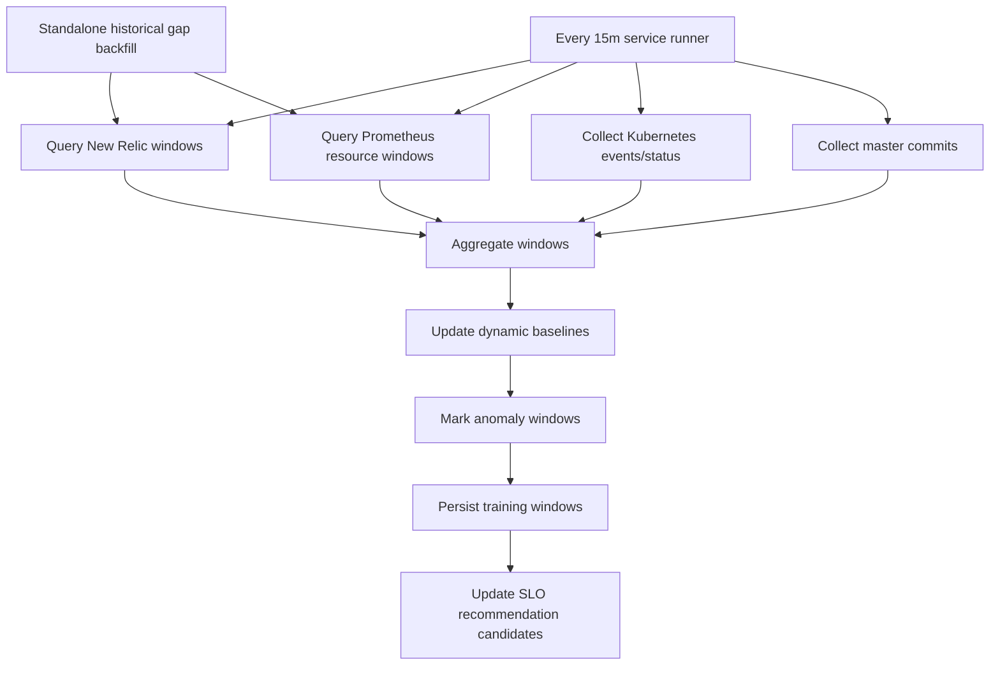

# 从历史数据制定 SLO

## 一、核心原则

SLO 不是历史平均值，也不是理想口号。比较稳的做法是先用历史数据回答三个问题：

| 问题 | 目的 |
| --- | --- |
| 用户实际体验是什么水平？ | 建立当前服务能力基线 |
| 业务真正不能接受的体验边界在哪里？ | 避免 SLO 只服务技术指标 |
| 现状和目标之间差距多大？ | 决定是先治理还是直接设 SLO |

第一版可以先做“历史基线型 SLO”：基于过去 30 天的 New Relic APM 数据、错误数据和 Prometheus 资源数据，为每个服务生成建议 SLO，再由 owner 审核。由于当前监控数据只保留 30 天，必须每天把原始监控数据切分、聚合、标注后存入自己的长期数据集，避免 30 天后失去训练和回放材料。

## 二、推荐数据窗口

| 数据窗口 | 用途 |
| --- | --- |
| 最近 7 天 | 看当前状态和短期波动 |
| 最近 30 天 | 生成第一版 SLO 建议 |
| 最近 90 天 | 只能依赖自建长期数据集；用于看周期性、促销、月底、节假日等影响 |
| 历史 incident 窗口 | 识别用户不可接受边界 |

建议默认使用监控系统中的最近 30 天生成第一版 SLO。第 31 天开始，90 天分析应来自自建的 `service_metric_windows` 数据集，而不是依赖 New Relic/Prometheus 原始留存。

## 三、SLI 分类

| SLI | 数据源 | 适用服务 | 说明 |
| --- | --- | --- | --- |
| Availability | New Relic error rate / successful transaction ratio | API、BFF、Web、gRPC | 优先按用户请求成功率定义 |
| Latency | New Relic p95/p99 transaction duration | API、BFF、Web、gRPC | Prometheus 当前不提供 p95/p99，不用于延迟 SLO |
| Throughput health | New Relic throughput | API、BFF、consumer | 用于辅助判断，不建议单独作为 SLO |
| Error budget burn | New Relic availability SLI | 所有关键在线服务 | 用于告警和风险预测 |
| Resource saturation | Prometheus CPU/memory/throttling/network | 所有 K8s workload | 作为风险信号，不直接等价于用户 SLO |
| Workload health | Kubernetes restart/OOMKilled/probe failure/rollout | 所有 K8s workload | 作为 incident inspect 和风险信号 |

## 四、按服务类型制定默认模板

| 服务类型 | 建议 SLI | 初始 SLO 建议 |
| --- | --- | --- |
| 用户入口 API/BFF | availability、p95 latency、p99 latency | availability 99.9%；p95 用历史 p75-p90 区间收敛 |
| 内部 domain service | availability、p95 latency | availability 99.5%-99.9%；延迟按调用链要求 |
| Consumer/job | success rate、lag/backlog、processing delay | 成功率 99.5%-99.9%；延迟按业务时效 |
| Adapter/integration | success rate、external dependency error | availability 99.0%-99.5%；区分自身错误和三方错误 |
| Infra/helper service | availability、resource saturation | 先用风险阈值，业务确认后再转 SLO |

## 五、历史数据计算方法

### 1. 清洗数据

历史数据要先排除或标记异常窗口：

| 窗口类型 | 处理方式 |
| --- | --- |
| 已知 incident | 单独标记，不直接作为正常基线 |
| 大促/流量峰值 | 保留，但单独分层分析 |
| 发布窗口 | 保留，用于变更风险建模 |
| 数据缺失 | 标记为 unknown，不自动当作成功 |
| 三方依赖故障 | 标记依赖来源，避免全部归因到本服务 |

### 2. 生成基线

对每个服务计算：

| 指标 | 计算 |
| --- | --- |
| p50/p75/p90/p95/p99 latency | New Relic transaction duration |
| error rate p50/p90/p95/max | New Relic transaction error percentage |
| availability | 1 - error rate |
| request volume | New Relic throughput |
| resource p90/p95/max | Prometheus CPU/memory/throttling |
| restart/OOM/probe failure count | Kubernetes events/status |

### 3. 切分训练窗口

为了把有限的 30 天监控数据变成可训练、可回放的数据，需要把连续时间序列切成固定窗口。

| 窗口 | 用途 | 建议粒度 |
| --- | --- | --- |
| 5m window | 快速异常、突刺、burn rate 快速消耗 | 在线风险预测 |
| 15m window | 常规 incident 检测、短期趋势 | 主要训练样本 |
| 1h window | 持续退化、慢性资源压力 | SLO burn rate 和趋势 |
| 1d window | 日级健康画像、容量趋势 | 报告和治理 |

第一版建议用 15 分钟作为主训练样本，每个窗口包含以下聚合特征：

```json
{
  "service": "payment-api",
  "window_start": "2026-06-04T10:00:00Z",
  "window_end": "2026-06-04T10:15:00Z",
  "newrelic": {
    "rpm_avg": 820,
    "rpm_max": 1600,
    "error_rate_avg": 0.02,
    "error_rate_max": 0.08,
    "latency_p95_ms": 420,
    "latency_p99_ms": 980
  },
  "prometheus_resources": {
    "cpu_usage_p95": 0.72,
    "memory_usage_p95": 0.81,
    "cpu_throttling_p95": 0.05
  },
  "kubernetes": {
    "restart_count": 0,
    "oom_killed_count": 0,
    "probe_failure_count": 0,
    "rollout_in_progress": false
  },
  "change": {
    "minutes_since_master_commit": 42,
    "recent_commit_count": 1
  }
}
```

### 4. 生成建议 SLO

建议规则：

| 场景 | 规则 |
| --- | --- |
| 历史 availability >= 99.95% 且 incident 少 | 初始 SLO 可设 99.9% |
| 历史 availability 在 99.5%-99.9% | 初始 SLO 设 99.5% 或先设治理目标 |
| 历史 availability < 99.5% | 不建议直接设高 SLO，先建 reliability roadmap |
| p95 latency 稳定 | SLO 阈值可取历史 p90 或业务可接受值中更宽松者 |
| p95 latency 波动大 | 先按服务类型分层，避免一个统一阈值误伤 |
| 低流量服务 | 用更长窗口或事件计数，避免少量请求导致误判 |

## 六、长期保留的数据集

因为 New Relic 和 Prometheus 只保留 30 天，Agent 需要维护自己的派生数据集。不要长期保存所有原始 metrics；保存“可训练、可解释、可回放”的聚合窗口。

### 推荐数据表

| 表 | 内容 | 保存周期 |
| --- | --- | --- |
| `service_metric_windows` | 每个服务每 5m/15m/1h 的聚合指标 | 12-24 个月 |
| `service_baselines` | 每个服务按小时/星期几分组的动态基线 | 12-24 个月 |
| `anomaly_windows` | 被标记为异常的窗口和原因 | 永久或 24 个月 |
| `incident_windows` | incident 影响窗口和人工结论 | 永久 |
| `service_metric_windows.change_context` | GitHub master commit、New Relic change event、rollout 相关上下文 | 12-24 个月 |
| `slo_recommendations` | SLO 建议、证据、审核状态 | 永久 |

### 训练样本结构

```json
{
  "service": "payment-api",
  "window_start": "2026-06-04T10:00:00Z",
  "window_size": "15m",
  "features": {
    "latency_p95_ratio_to_baseline": 1.42,
    "latency_p99_ratio_to_baseline": 1.68,
    "error_rate_delta": 0.06,
    "throughput_ratio_to_baseline": 0.73,
    "cpu_usage_ratio_to_baseline": 1.21,
    "memory_usage_ratio_to_baseline": 1.08,
    "restart_count": 0,
    "probe_failure_count": 2,
    "minutes_since_change": 18
  },
  "labels": {
    "is_anomaly": true,
    "severity": "warning",
    "anomaly_types": ["latency_degradation", "probe_failure"],
    "is_incident": false,
    "label_source": ["rule"],
    "reviewed": false
  }
}
```

## 七、如何标记异常窗口

异常标记建议分三层：规则标签、动态基线标签、人工/incident 标签。第一版先用规则和动态基线，后续再让 on-call 反馈修正。

### 1. 基于 SLO 的异常

| 异常类型 | 标记规则 |
| --- | --- |
| availability_breach | 窗口内 availability 低于 SLO 目标 |
| latency_breach | 窗口内 p95/p99 latency 超过 SLO 阈值 |
| burn_rate_high | 5m/1h/6h burn rate 超过阈值 |

### 2. 基于动态基线的异常

仅用固定阈值会漏掉“相对自身异常”的服务，因此要按服务自己的历史行为建动态基线。

推荐基线维度：

| 维度 | 说明 |
| --- | --- |
| service | 每个服务独立建模 |
| day_of_week | 区分工作日和周末 |
| hour_of_day | 区分高峰和低峰 |
| traffic_bucket | 区分低流量和高流量 |

推荐标记规则：

| 异常类型 | 规则 |
| --- | --- |
| latency_degradation | 当前 p95 > 同服务同小时历史 p95 基线 * 1.5，且持续 2 个窗口 |
| error_spike | 当前 error rate > max(历史 p95 * 2, 绝对阈值)，且请求量足够 |
| throughput_drop | 当前 throughput < 历史 p10 * 0.5，且不是低峰时段 |
| resource_saturation | CPU/memory/throttling 超过历史 p95 或接近 limit |
| workload_instability | restart、OOMKilled、probe failure、rollout 卡住 |

低流量服务要加最小请求量保护：

```text
如果 15m 窗口请求数 < 100，则不直接用百分比判定 error spike；
改用错误计数、连续窗口、或 1h 窗口判断。
```

### 3. 基于 incident 的标签

如果某个时间窗口落在人工确认的 incident 影响范围内，应标记：

```json
{
  "is_incident": true,
  "incident_id": "INC-2026-001",
  "incident_severity": "P1",
  "root_cause_category": "deployment_regression",
  "affected_services": ["payment-api", "checkout-web"],
  "label_source": ["incident"]
}
```

incident 标签优先级最高，可覆盖普通 anomaly 标签。

### 4. 异常严重度

| 严重度 | 判断 |
| --- | --- |
| info | 单个信号轻微偏离，未持续 |
| warning | 两个以上信号异常，或单个核心 SLI 持续 2 个窗口 |
| critical | SLO breach、burn rate high、明显用户影响、或 K8s 大量失败事件 |

### 5. 标签置信度

| confidence | 含义 |
| --- | --- |
| high | SLO breach、incident 标记、多个信号一致 |
| medium | 动态基线明显偏离，但用户影响不确定 |
| low | 单一信号异常、低流量、数据缺失 |

## 八、每日数据流水线

每天运行一次回填任务，另外每 5-15 分钟运行一次在线增量任务。



### 回填策略

| 任务 | 建议 |
| --- | --- |
| 首次初始化 | 拉取最近 30 天，按 15m 和 1h 切窗 |
| 历史缺口回填 | 用独立 cron/CronJob 扫描 runner gap window 之外的半个月区间，有缺口才调用 bulk collector |
| 长期保存 | 保存聚合窗口、标签、基线，不依赖原始监控留存 |
| 版本化 | baseline 和 label rule 都要带 version，方便重算 |

## 九、标注规则版本化

异常标签会随着规则调整而变化，所以必须保存规则版本。

```yaml
label_rule_version: slo-anomaly-rules-v1
baseline_version: baseline-30d-hourly-v1
generated_at: "2026-06-04T12:00:00Z"
```

当规则升级时，不要覆盖旧标签；新增一版标签结果，保留可对比性。

## 十、SLO 建议输出格式

Agent 应为每个服务生成可审阅的建议，而不是直接写死 catalog。

```json
{
  "service": "payment-api",
  "window": "30d",
  "traffic_profile": {
    "avg_rpm": 820,
    "peak_rpm": 4200
  },
  "historical_baseline": {
    "availability": 99.94,
    "latency_p95_ms": 420,
    "latency_p99_ms": 980,
    "error_rate_p95": 0.08
  },
  "recommended_slo": {
    "availability_target": 99.9,
    "latency_p95_ms": 500,
    "latency_p99_ms": 1200
  },
  "confidence": "high",
  "evidence": [
    "30d availability is 99.94%",
    "p95 latency stayed below 500ms for 96.8% of valid windows",
    "no repeated OOMKilled or rollout failures in Kubernetes"
  ],
  "review_required": [
    "confirm whether checkout peak-hour latency above 500ms is business acceptable"
  ]
}
```

当前第一版由 `scripts/generate_slo_recommendations.py` 生成，并写入
`slo_recommendations` 表。服务运行后也可以通过 API 生成和查询：

```bash
python3 scripts/generate_slo_recommendations.py --days 30 --replace

curl -X POST http://127.0.0.1:8080/slo/recommendations/generate \
  -H 'Content-Type: application/json' \
  -d '{"days":30,"replace":true}'

curl 'http://127.0.0.1:8080/slo/recommendations?recommendation_version=slo-rec-v1'
```

生成规则：

| 字段 | 计算方式 |
| --- | --- |
| `recommendation_version` | 默认 `slo-rec-v1`，同版本未审核记录可用 `--replace` 重建 |
| `recommendation_window` | 默认 `30d`，基于 `service_metric_windows` 的 `15m` 聚合窗口 |
| `availability_target` | 用请求量加权 error rate 反推历史 availability，再推荐 99.9 / 99.5 / 99.0 |
| `error_rate_percent` | `100 - availability_target`，最低保留 0.1% |
| `latency_p95_ms` | 历史窗口级 p95 latency 的 p95 值增加 10% headroom 后取整 |
| `latency_p99_ms` | 历史窗口级 p99 latency 的 p95 值增加 15% headroom 后取整 |
| `target_type` | `slo_candidate` / `provisional_slo_candidate` / `reliability_roadmap` / `low_traffic_candidate` / `needs_data` / `edge_service` |
| `confidence` | 由整体覆盖率、New Relic 覆盖率、latency 样本覆盖率和 review flags 决定 |
| `status` | 初始统一为 `pending_review`，审核后再同步到 catalog |

以下情况不会直接视为可用正式 SLO，会进入 owner review：

| 场景 | 原因 |
| --- | --- |
| 总请求量低于 1000 | 低流量服务历史 100% 可用不代表可靠性目标可设到 99.9% |
| New Relic 覆盖率低于 95% | availability 和 latency 证据不足 |
| latency 样本缺失 | 无法推荐 p95/p99 latency SLO |
| job / consumer 服务 | 不直接生成 HTTP latency SLO，需要补充业务成功率、freshness、lag 等领域 SLI |
| SSE / streaming 服务 | 不直接生成 HTTP latency SLO，需要补充连接成功率、断连率、消息投递延迟或事件投递成功率 |
| 历史 availability 低于 99.5% | 先进入 reliability roadmap，而不是把坏体验合法化 |

当前 `slo-rec-v1` 有一组人工审查后的策略例外：

| 服务 | 处理方式 | 原因 |
| --- | --- | --- |
| `auth-api` | 可作为 `slo_candidate` | 低可用性主要来自稳定/周期性错误模式，第一版用计算值作为 SLO 候选 |
| `backoffice-v2-bff` | 可作为 `slo_candidate` | 低可用性主要来自稳定/周期性错误模式，第一版用计算值作为 SLO 候选 |
| `beep-v1-web` | 可作为 `slo_candidate` | 低可用性主要来自稳定/周期性错误模式，第一版用计算值作为 SLO 候选 |
| `otp-api` | 可作为 `slo_candidate` | 低可用性可能包含业务预期失败，第一版先用计算值作为 SLO 候选，后续再拆系统错误和业务失败 |
| `e-invoice-adapter-svc` | 保留 review | 错误率集中在局部时间点，疑似外部依赖或尖峰异常，不自动沉淀为正式 SLO |
| `backoffice-migrate-jobs` | 标记为 `edge_service` | 从主业务剥离出来的 job，不按 HTTP request/latency 生成 SLO |
| `core-event-consumer-zendesk` | 标记为 `edge_service` | 从主业务剥离出来的 consumer/job，不按 HTTP request/latency 生成 SLO |
| `3p-webhook-adapter-infra-svc` | 标记为 `provisional_slo_candidate` | 低流量服务先使用计算值作为暂定 SLO，等 webhook 成功率/失败率等自定义指标接入后重算 |
| `core-event-consumer-payment` | 标记为 `provisional_slo_candidate` | consumer 先使用计算值作为暂定 SLO，等消费成功率、lag、DLQ、freshness 等自定义指标接入后重算 |

## 十一、Error Budget

SLO 要能转成 error budget，Agent 才能做风险预测和发布建议。

| SLO | 30 天允许不可用时间 |
| --- | --- |
| 99.0% | 7h 12m |
| 99.5% | 3h 36m |
| 99.9% | 43m 12s |
| 99.95% | 21m 36s |
| 99.99% | 4m 19s |

初版 burn rate 告警建议：

| 窗口 | 条件 | 含义 |
| --- | --- | --- |
| 5m | burn rate > 14.4 | 快速故障，立即调查 |
| 1h | burn rate > 6 | 持续异常，需要 on-call 关注 |
| 6h | burn rate > 3 | 慢性消耗，需要当天处理 |
| 3d | burn rate > 1 | 长期质量退化，需要排期治理 |

## 十二、落地流程

```mermaid
flowchart TD
    Catalog["service-catalog.yaml"] --> Resolve["Resolve New Relic entity"]
    Resolve --> QueryNR["Query New Relic 30/90d history"]
    Catalog --> QueryProm["Query Prometheus resource history"]
    Catalog --> QueryK8s["Inspect Kubernetes historical events if available"]
    QueryNR --> Baseline["Build service baseline"]
    QueryProm --> Baseline
    QueryK8s --> Baseline
    Baseline --> Recommend["Generate SLO recommendation"]
    Recommend --> Review["Owner review"]
    Review --> CatalogUpdate["Update service-catalog.yaml SLO"]
    CatalogUpdate --> Alert["Enable burn-rate alerts and risk scoring"]
```



## 十三、需要避免的坑

| 风险 | 建议 |
| --- | --- |
| 直接用当前 p95 当 SLO | 容易把历史坏体验合法化 |
| 所有服务用同一延迟标准 | API、consumer、adapter 的体验边界不同 |
| 只看平均值 | 必须看 p95/p99 和窗口分布 |
| 把资源指标当用户 SLO | CPU/memory 是风险信号，不是用户体验本身 |
| 低流量服务误判 | 低流量要用更长窗口或事件数 |
| 不区分三方错误 | adapter/integration 要区分自身错误和外部依赖错误 |
| 只保留监控原始数据 | 30 天后无法训练和回放，必须保存聚合窗口和标签 |
| 标签不可追溯 | 每个异常标签必须带 rule version、baseline version 和 evidence |

## 十四、第一版建议

第一版先不要追求完美 SLO。建议对 51 个服务批量生成以下字段：

```yaml
slo:
  availability_target: 99.9
  latency_p95_ms: 500
  latency_p99_ms: 1200
  source: historical_recommendation
  window: 30d
  confidence: medium
  reviewed: false
```

然后让服务 owner 审核。审核通过后，SRE Agent 再使用这些 SLO 做 burn rate、风险预测和 incident 优先级判断。
