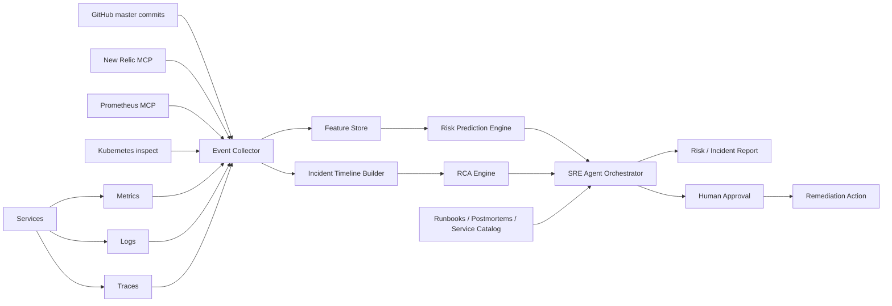
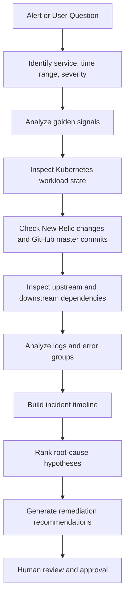
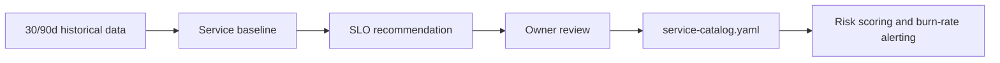

# SRE Agent Design

## 一、方案背景

服务故障通常不是突然出现的。大多数 incident 前都会有可观测信号：延迟抬升、错误率波动、SLO burn rate 异常、队列积压、依赖超时、资源耗尽、部署变更、配置漂移等。

SRE Agent 的目标不是替代 on-call，而是成为一个可靠的“副驾驶”：提前发现危险状态，在 incident 发生时快速整理证据、缩短定位时间，并给出可执行、可审计的整改建议。

结合当前环境，第一版数据源以 Prometheus、New Relic MCP 和 Kubernetes inspect 为主。Prometheus 只承担资源指标查询，不假设它提供 p95/p99 等应用性能指标；应用 golden signals、p95/p99、事务、错误和日志优先从 New Relic MCP 查询。由于目前没有独立部署事件源，生产环境又统一使用 `master` 分支，因此可以把 GitHub `master` 最新提交作为“变更事件代理”：用 commit 时间、commit message、diff 文件范围和作者信息，与指标、日志、Kubernetes 事件异常做时间相关性分析。

## 二、建设目标

| 目标 | 说明 | 成功标准 |
| --- | --- | --- |
| 提前预警 | 在告警触发或用户影响扩大前发现风险 | 高危事件提前 5-30 分钟提示 |
| 快速定位 | 自动关联指标、日志、链路、部署和依赖 | 5 分钟内生成初版 incident timeline |
| 有效建议 | 给出可执行整改措施，而不是泛泛建议 | 建议包含证据、步骤、风险和回滚方式 |
| 可审计 | 所有结论能追溯到数据来源 | 每个判断带 evidence 和 confidence |
| 人机协作 | 生产变更保持人工确认 | 自动诊断，半自动执行 |

## 三、总体架构



## 四、核心模块设计

| 模块 | 职责 | 输入 | 输出 |
| --- | --- | --- | --- |
| Service Catalog | 维护服务、owner、依赖、SLO、runbook、GitHub repo、Kubernetes workload | CMDB、K8s、New Relic、GitHub | 服务上下文 |
| Signal Collector | 汇聚应用指标、资源指标、日志、traces、alerts、K8s 状态、GitHub commits | Prometheus MCP、New Relic MCP、Kubernetes、GitHub | 标准化事件 |
| Feature Store | 生成风险特征 | 时间序列、事件、依赖状态 | 延迟趋势、错误趋势、burn rate、变更距离 |
| Training Dataset Builder | 将 30 天监控留存转成长期训练样本 | New Relic、Prometheus、K8s、GitHub | 聚合窗口、动态基线、异常标签 |
| Risk Engine | 预测服务是否危险 | 特征、SLO、历史 incident | risk score、风险原因 |
| RCA Engine | 事故溯源 | timeline、依赖图、异常信号 | 根因假设排序 |
| Recommendation Engine | 生成整改建议 | runbook、历史案例、当前证据 | 操作建议、回滚建议 |
| Agent Orchestrator | 编排工具调用和推理链路 | 用户问题、告警、事件 | 报告、建议、审批请求 |

## 五、当前数据源适配

| 数据源 | 用途 | 第一版接入方式 | 注意点 |
| --- | --- | --- | --- |
| Prometheus MCP | 资源指标、容器/Pod CPU、内存、网络、磁盘、资源饱和度 | PromQL instant/range query | 不用于 p95/p99；只维护资源类 PromQL 模板 |
| New Relic MCP | APM golden metrics、p95/p99 latency、throughput、error rate、transactions、logs、error groups、alert issues | New Relic MCP tools | 优先按 entity GUID 查询，避免靠名称模糊匹配 |
| Kubernetes inspect | Deployment/StatefulSet/Pod 状态、rollout、restart、events、probe、调度、资源限制、镜像版本 | Kubernetes API 或只读 kubectl 工具 | 作为 incident 调研必查流程，所有操作默认只读 |
| GitHub `master` | 变更事件代理、代码 diff、可能影响范围 | GitHub API 或本地 repo 最新提交 | commit 时间不一定等于真实发布时间，需要在报告中标记为 inferred |
| Service Catalog | 服务 owner、repo、SLO、依赖关系、K8s namespace/workload/selector | 先用 YAML/JSON 配置 | 后续可接 CMDB/K8s/New Relic entity tags |

当前已有一份服务 mapping，已转换为 `config/service-catalog.yaml`。其中 New Relic 字段目前包含 `app_name` 和 `app_id`；如果后续 New Relic MCP 查询必须使用 entity GUID，Agent 应先通过 app name/app id 做一次 entity resolution，并把结果回写到 catalog 或缓存中。

### 信号职责边界

| 信号类型 | 首选来源 | 说明 |
| --- | --- | --- |
| p95/p99 latency | New Relic MCP | Prometheus 当前没有应用延迟分位数，不从 Prometheus 计算 |
| throughput | New Relic MCP | 用 APM transaction/request throughput |
| error rate | New Relic MCP | 用 APM error rate、error groups、transaction errors |
| logs/errors | New Relic MCP | 用 logs、error groups、transaction samples |
| CPU/memory/network/disk | Prometheus MCP | 容器、Pod、Node、队列等资源压力 |
| Pod restarts/events/probes | Kubernetes inspect | 识别 CrashLoopBackOff、OOMKilled、probe failure、ImagePull、调度失败 |
| rollout/image/config | Kubernetes inspect + GitHub | 查实际运行镜像、rollout revision、config/secret/env 引用和代码变更 |

Kubernetes mapping 当前包含 namespace 和 deployment 名称。label selector 不强依赖人工配置，第一版 inspect 工具可以先读取 Deployment/StatefulSet 的 `.spec.selector.matchLabels`，再用真实 selector 查询 Pods、Events、Service endpoints。

### GitHub 作为部署事件代理

由于没有独立部署事件，第一版可以建立 `master` commit 到生产变更的推断规则：

| 推断信号 | 说明 | 可信度 |
| --- | --- | --- |
| 最新 `master` commit 时间 | 作为最近变更窗口的起点 | 中 |
| commit message / PR title | 判断是否涉及配置、依赖、数据库、缓存、限流等高风险变更 | 中 |
| diff 文件路径 | 判断影响服务、模块和风险类型 | 中高 |
| 作者和 review 信息 | 判断 owner 和追踪对象 | 中 |
| New Relic change events | 如果某些服务已经上报 deployment marker，则优先使用 | 高 |

输出时必须区分事实和推断。例如：

```json
{
  "change_event": {
    "source": "github_master_commit",
    "confidence": "medium",
    "inferred": true,
    "commit": "abc1234",
    "message": "increase checkout timeout",
    "changed_files": ["services/payment/timeout.go"],
    "reason": "production is assumed to run master and anomaly started 9 minutes after commit"
  }
}
```

## 六、风险预测逻辑

风险分数建议先用可解释的规则模型，再逐步加入机器学习。

| 信号 | 示例 | 权重建议 |
| --- | --- | --- |
| SLO burn rate | 1h burn rate > 14.4 | 高 |
| 错误率异常 | New Relic 当前错误率超过 7 日同周期 p95 | 高 |
| 延迟异常 | New Relic p95/p99 连续上升且吞吐下降 | 高 |
| 资源压力 | CPU throttling、内存接近 limit、GC pause 上升 | 中 |
| K8s 工作负载异常 | Pod restart、OOMKilled、CrashLoopBackOff、probe failure、rollout 未完成 | 高 |
| 队列积压 | Kafka lag、任务队列 backlog 增长 | 高 |
| 依赖异常 | 下游超时、数据库连接池耗尽 | 高 |
| 近期变更 | New Relic deployment marker 或 GitHub `master` 最新提交后 30 分钟内异常 | 高 |
| 告警噪声 | 多个相关服务同时间触发 | 中 |

风险输出应避免只给分数，推荐结构如下：

```json
{
  "service": "payment-api",
  "risk_level": "high",
  "risk_score": 0.86,
  "predicted_failure_modes": ["slo_breach", "dependency_timeout"],
  "evidence": [
    "p95 latency increased 43% in 20 minutes",
    "error budget burn rate reached 18x",
    "latest master commit was created 12 minutes before anomaly"
  ],
  "recommended_next_steps": [
    "inspect latest deployment diff",
    "compare dependency timeout rate",
    "prepare rollback if burn rate remains above 14.4x for 5 minutes"
  ]
}
```

## 七、Incident 调研流程



### 根因假设排序

| 维度 | 判断问题 |
| --- | --- |
| 时间相关性 | 异常是否紧跟部署、配置、依赖变化？ |
| 影响范围 | 是单服务、单 AZ、单节点、单依赖，还是全局？ |
| 指标一致性 | 延迟、错误、吞吐、资源、队列是否能互相解释？ |
| K8s 状态 | 是否存在 Pod 重启、OOMKilled、probe 失败、rollout 卡住、调度失败？ |
| 历史相似性 | 是否与历史 incident 或 postmortem 相似？ |
| 可验证性 | 是否能通过日志样本、trace span、指标 facet 验证？ |

## 八、建议的 Agent 工具清单

第一版可以把 Agent 能力拆成只读工具，降低生产风险。

| 工具 | 输入 | 输出 |
| --- | --- | --- |
| `prometheus.query_range` | PromQL、时间范围、step | 时间序列和异常点 |
| `newrelic.golden_metrics` | entity GUID、时间范围 | APM golden signals |
| `newrelic.transactions` | entity GUID、时间范围 | 慢事务、错误率、吞吐 |
| `newrelic.logs` | entity GUID、时间范围 | 错误模式和样例日志 |
| `newrelic.error_groups` | entity GUID、时间范围 | 错误聚类 |
| `kubernetes.inspect_workload` | namespace、kind、name、时间范围 | workload 状态、replicas、rollout、镜像、重启 |
| `kubernetes.inspect_pods` | namespace、label selector、时间范围 | Pod phase、restart、container status、OOMKilled |
| `kubernetes.inspect_events` | namespace、involved object、时间范围 | FailedScheduling、Unhealthy、Killing、PullBackOff 等事件 |
| `kubernetes.inspect_resources` | namespace、workload/pod | requests、limits、HPA、PDB、service、endpoints |
| `github.latest_master_commits` | repo、时间范围 | commit、author、message、changed files |
| `github.diff_risk_classifier` | changed files、diff | 风险类型和影响面 |
| `service_catalog.lookup` | service name | owner、repo、SLO、entity GUID、K8s workload、New Relic signal query、Prometheus resource query |

## 九、整改建议标准

每条建议都应该包含：

| 字段 | 说明 |
| --- | --- |
| Action | 具体要做什么 |
| Reason | 为什么做 |
| Evidence | 支撑证据 |
| Risk | 可能副作用 |
| Rollback | 如何回滚 |
| Owner | 建议执行人或团队 |
| Urgency | 立即、当天、本周、长期 |

示例：

```json
{
  "action": "rollback payment-api release 2026.06.04.2",
  "reason": "latency and error rate anomalies started 8 minutes after deployment",
  "evidence": ["p95 +43%", "5xx +6.8%", "new timeout stack trace introduced"],
  "risk": "may reintroduce previous minor checkout bug",
  "rollback": "redeploy release 2026.06.04.1 from CI artifact",
  "urgency": "immediate",
  "requires_approval": true
}
```

## 十、MVP 落地路线

| 阶段 | 时间 | 目标 | 交付 |
| --- | --- | --- | --- |
| Phase 1 | 1 周 | 接入现有数据源 | 服务清单、Prometheus 资源指标、New Relic APM 指标、Kubernetes inspect、GitHub master commits |
| Phase 2 | 1-2 周 | 风险评分 PoC | risk score API、风险报告、Top risky services |
| Phase 3 | 2 周 | incident 调研 | timeline、异常摘要、根因假设排序 |
| Phase 4 | 2 周 | 整改建议 | runbook 检索、建议生成、人工审批 |
| Phase 5 | 持续 | 反馈学习 | postmortem 入库、建议效果跟踪 |

## 十一、技术选型建议

| 层级 | 建议 |
| --- | --- |
| Agent 编排 | LangGraph、OpenAI Agents SDK、Temporal 或自研状态机 |
| 指标 | Prometheus MCP 查资源指标，New Relic MCP 查应用指标 |
| 日志 | New Relic MCP，后续可补 VictoriaLogs/Loki/Elastic |
| Trace | New Relic MCP，后续可补 OpenTelemetry/Jaeger/Tempo |
| Kubernetes | Kubernetes API 或只读 kubectl inspect 工具 |
| 变更事件 | GitHub `master` commits，后续补 CI/CD deployment markers |
| 知识库 | pgvector、OpenSearch、LlamaIndex、Qdrant |
| 存储 | PostgreSQL 存聚合窗口、标签、SLO 建议和 incident timeline；S3/Object Storage 存原始快照、报告和训练集导出 |
| UI | Web dashboard + Slack/Lark bot |
| 执行 | 只读诊断默认自动，生产写操作必须审批 |

## 十二、验收标准

| 能力 | 验收方式 |
| --- | --- |
| 风险预测 | 对历史 incident 回放，能提前识别 60% 以上高危事件 |
| RCA | 对 P1/P2 incident，初版 timeline 召回关键事件 |
| 建议质量 | 建议被 on-call 采纳或部分采纳比例可度量 |
| 安全性 | 无审批不执行生产变更 |
| 可解释性 | 每个结论至少关联一条 evidence |

## 十三、SLO 标准制定

SLO 不建议一开始手工拍脑袋写入。第一版应根据历史数据生成建议值，再由服务 owner 审核确认。详细方法见 `docs/slo-from-history.md`。

| 数据 | 来源 | 用途 |
| --- | --- | --- |
| p95/p99 latency | New Relic MCP | 生成 latency SLO 建议 |
| error rate / availability | New Relic MCP | 生成 availability SLO 和 error budget |
| throughput | New Relic MCP | 区分高低流量服务，避免低流量误判 |
| CPU/memory/throttling | Prometheus MCP | 判断资源压力是否影响 SLO 可达性 |
| restart/OOM/probe failure | Kubernetes inspect | 判断 workload 稳定性和治理优先级 |

SLO 推荐流程：



由于 New Relic 和 Prometheus 原始数据只保留 30 天，Agent 必须定期把监控数据切成 5m/15m/1h 窗口，长期保存聚合特征、动态基线和异常标签。异常窗口应通过 SLO breach、动态基线偏离、Kubernetes workload 异常、incident 人工标签共同标记，并带上 `label_rule_version`、`baseline_version` 和 evidence，保证后续训练可追溯。

存储建议见 `docs/data-storage.md`。第一版推荐 PostgreSQL + S3：PostgreSQL 保存可查询的窗口数据、动态基线、异常标签、SLO 建议和 incident timeline；S3 保存原始查询快照、长报告和训练数据导出。

## 十四、需要补齐的关键配置

建议先用一个 `service-catalog.yaml` 管理服务上下文：

```yaml
services:
  - name: payment-api
    owner: payment-platform
    github_repo: org/payment-api
    production_branch: master
    newrelic_entity_guid: "REPLACE_ME"
    slo:
      availability_target: 99.9
      latency_p95_ms: 500
    kubernetes:
      namespace: production
      workload_kind: Deployment
      workload_name: payment-api
      label_selector: app=payment-api
    prometheus_resources:
      cpu_usage: 'sum(rate(container_cpu_usage_seconds_total{namespace="production", pod=~"payment-api-.*"}[5m]))'
      memory_usage: 'sum(container_memory_working_set_bytes{namespace="production", pod=~"payment-api-.*"})'
    newrelic_signals:
      p95_latency: "APM golden metrics or Transaction percentile query"
      p99_latency: "APM golden metrics or Transaction percentile query"
      error_rate: "APM error rate"
      throughput: "APM throughput"
```

## 十五、管理层摘要

SRE Agent 的核心价值是把“被动响应”推进到“提前发现 + 快速定位 + 可执行整改”。在当前条件下，第一阶段可以直接基于 Prometheus MCP、New Relic MCP、Kubernetes inspect 和 GitHub `master` 提交记录落地，不必等待完整部署事件平台。Prometheus 用于资源风险，New Relic 用于应用性能和错误，Kubernetes 用于 workload 现场状态。需要注意的是，GitHub commit 只能作为变更事件代理，报告中必须标记为 inferred，避免把推断当成事实。等 CI/CD 或 New Relic deployment marker 完善后，再把真实部署事件替换为高可信数据源。
